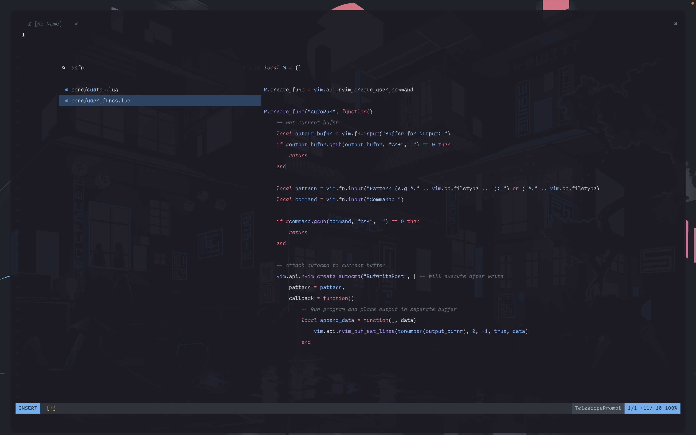
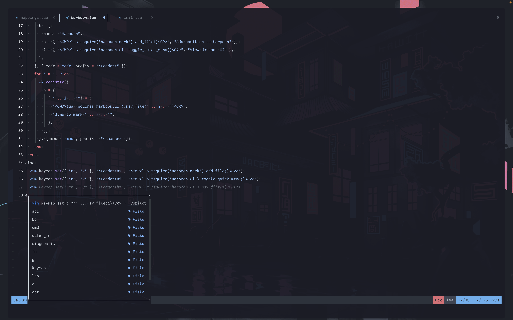
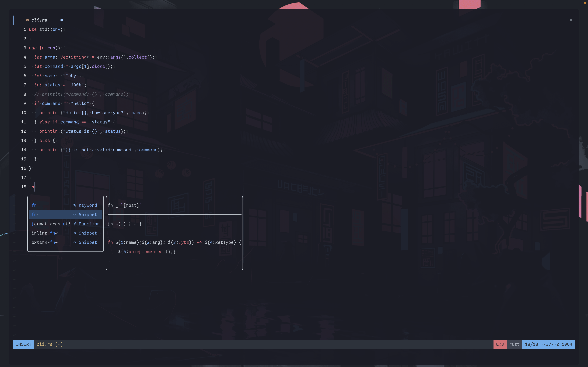

# Toby's Neovim Config

<div align="center">
    	<a href="#install">Install</a>
  <span> • </span>
        <a href="#features">Features</a>
</div>

<h2>Showcase</h2>






<h2 id="install">Install</h2>
```terminal
$ git clone https://github.com/TobyBridle/neovim-config ./nvim && nvim ./nvim/lua/plugins.lua +PackerSync
```
There are quite a few command-line dependencies (e.g ripgrep, LazyGit). To find the ones which you have not installed, run `:checkhealth` from within neovim upon install.

<h2 id="features">Features</h2>
- Easy configuration of basic things such as colorscheme from within `core/custom.lua`
- Most plugins are lazy-loaded meaning that they are only loaded as of when they are needed
- Inbuilt toggleable terminal using **FTerm.lua**
- Git management using LazyGit
- File searching, Word finding and more using **Telescope**
- Autocompletion and snippets using **nvim-cmp**
- Mappings keysheet using **which-key**
